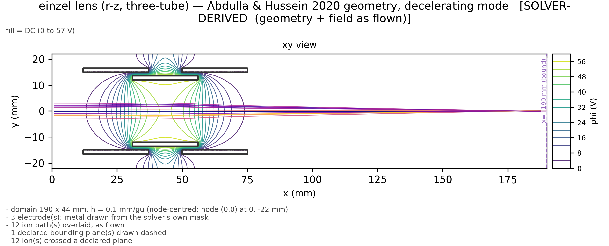
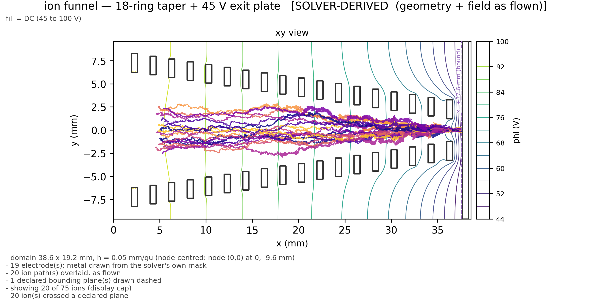
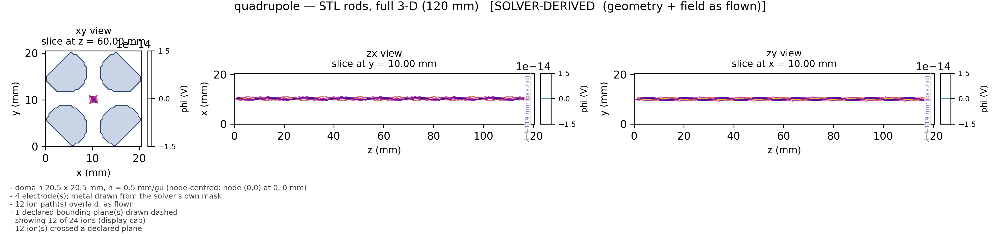

# ion_gym manual figures

generated 2026-09-04 03:17:34

## einzel lens (r-z, three-tube) — Abdulla & Hussein 2020 geometry, decelerating mode
**SOLVER-DERIVED  (geometry + field as flown)**

- domain 190 x 44 mm, h = 0.1 mm/gu (node-centred: node (0,0) at 0, -22 mm)
- 3 electrode(s); metal drawn from the solver's own mask
- 12 ion path(s) overlaid, as flown
- 1 declared bounding plane(s) drawn dashed
- 12 ion(s) crossed a declared plane

## ion funnel — 18-ring taper + 45 V exit plate
**SOLVER-DERIVED  (geometry + field as flown)**

- domain 38.6 x 19.2 mm, h = 0.05 mm/gu (node-centred: node (0,0) at 0, -9.6 mm)
- 19 electrode(s); metal drawn from the solver's own mask
- 20 ion path(s) overlaid, as flown
- 1 declared bounding plane(s) drawn dashed
- showing 20 of 75 ions (display cap)
- 20 ion(s) crossed a declared plane

## quadrupole — STL rods, full 3-D (120 mm)
**SOLVER-DERIVED  (geometry + field as flown)**

- domain 20.5 x 20.5 mm, h = 0.5 mm/gu (node-centred: node (0,0) at 0, 0 mm)
- 4 electrode(s); metal drawn from the solver's own mask
- 12 ion path(s) overlaid, as flown
- 1 declared bounding plane(s) drawn dashed
- showing 12 of 24 ions (display cap)
- 12 ion(s) crossed a declared plane
